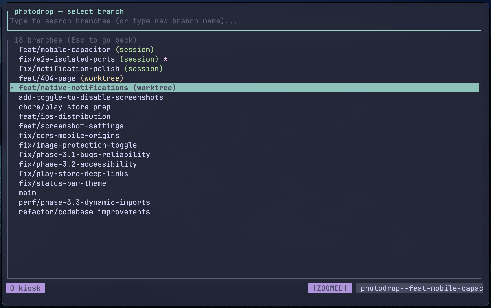

# kiosk

Kiosk is a Git-aware tmux session manager. Search for the repo you want, and optionally select a branch or create a new one. If a session already exists, you jump straight in - if it doesn't, a new session is created, with a new worktree if needed.



Worktrees are created in `.kiosk_worktrees/` in the parent directory of the given repository. For instance, if you set `search_dirs = ["~/Development"]`, then worktrees are created at `~/Development/.kiosk_worktrees/`.


## Usage

### TUI

Add a keybinding to your `tmux.conf` to open Kiosk in a popup - the following uses `<prefix> f`, but change as appropriate:

```tmux
bind-key f popup -xC -yC -w90% -h90% -E "kiosk"
```

- On first interactive launch (when no config file exists), you'll see a setup wizard to create your config file. If you'd rather do this manually, see the [configuration](#configuration) section.
- You'll start in the repo view, which shows all repos in the folders defined in your config:
  - Start typing to fuzzy search across repos
  - Enter opens the repo with the primary checkout
  - Tab opens the branch view for that repo
- From the branch view, you can again fuzzy match across branches:
  - Enter opens a session in a worktree on that branch, either attaching to an existing session if one exists, or creating a new one otherwise

### CLI

You can also use Kiosk as a CLI, which is particularly useful for AI agents. Below are some example commands, but see `kiosk --help` for a complete list of commands and options.

<details>

#### Examples

```bash
# List repos
kiosk list --json

# List branches with metadata
kiosk branches my-project --json

# Create a new branch, worktree, and tmux session (without attaching)
kiosk open my-project --new-branch feat/thing --base main --no-switch --json

# Launch a command in the session (the command is typed and Enter is sent automatically)
kiosk open my-project feat/thing --no-switch --run "your-command-here" --log --json

# Send a follow-up command to an existing session
kiosk send my-project feat/thing --command "another-command" --json

# Send raw tmux keys (e.g. for TUI interaction — no Enter appended)
kiosk send my-project feat/thing --keys "C-c" --json
kiosk send my-project feat/thing --keys "Escape" --json

# Send literal text without appending Enter
kiosk send my-project feat/thing --text "y" --json

# Target a specific pane (default: 0)
kiosk send my-project feat/thing --command "ls" --pane 1 --json
kiosk status my-project feat/thing --pane 1 --json

# List panes in a session
kiosk panes my-project feat/thing --json

# Check session status
kiosk status my-project feat/thing --json

# List active kiosk sessions (includes last_activity, pane_count, current_command)
kiosk sessions --json

# Read session logs
kiosk log my-project feat/thing --tail 100 --json

# Show resolved configuration
kiosk config show --json

# Non-interactive cleanup of orphaned worktrees
kiosk clean --yes --json

# Delete a specific worktree and session when done
kiosk delete my-project feat/thing --force --json
```

#### Waiting for completion

Use `--wait` on `open` to block until the command finishes:

```bash
# Launch, wait for completion, then read output — all in one
kiosk open my-project feat/thing --no-switch --run "cargo test" --wait --wait-timeout 300 --log --json
kiosk log my-project feat/thing --tail 200 --json
```

Or use the standalone `wait` command for commands sent later:

```bash
kiosk send my-project feat/thing --command "cargo test"
kiosk wait my-project feat/thing --timeout 300 --json
```

#### Session naming

Kiosk names tmux sessions deterministically:
- Main checkout: `<repo-name>` (dots replaced with `_`)
- Branch worktree: `<repo-name>--<branch>` (with `/` replaced by `-`, `.` replaced by `_`)

The `open --json` response includes the exact session name in the `session` field.

</details>

## Installing

### Homebrew

```sh
brew install thomasschafer/tap/kiosk
```

### Cargo

Ensure you have the Rust toolchain installed, then run:

```sh
cargo install kiosk
```

### Prebuilt binaries

Download the appropriate binary for your system from the [releases page](https://github.com/thomasschafer/kiosk/releases/latest):

| Platform | Architecture | Download file |
|-|-|-|
| Linux | Intel/AMD | `*-x86_64-unknown-linux-musl.tar.gz` |
| Linux | ARM64 | `*-aarch64-unknown-linux-musl.tar.gz` |
| macOS | Apple Silicon| `*-aarch64-apple-darwin.tar.gz` |
| macOS | Intel | `*-x86_64-apple-darwin.tar.gz` |
| Windows | x64 | `*-x86_64-pc-windows-msvc.zip` |

After downloading, extract the binary and move it to a directory in your `PATH`.

### Building from source

Ensure you have the Rust toolchain installed, then pull down the repo and run:

```sh
cargo install --path kiosk
```


## Configuration

You'll need a config file to get started. By default, Kiosk looks for a TOML configuration file at:

- Linux or macOS: `~/.config/kiosk/config.toml`
- Windows: `%AppData%\kiosk\config.toml`

Here's a minimal example that contains all required keys (change values as appropriate):

```toml
search_dirs = ["~/Development"]
```

### Config options

The following options can be set in your configuration file:

<!-- CONFIG START -->
#### `search_dirs`

Directories to scan for git repositories. Each directory can be scanned to a specified depth, with a default of 1 (i.e. just the top level).
Supports `~` for the home directory. For example:
```toml
search_dirs = ["~/Development", { path = "~/Work", depth = 2 }]
```

### `[session]` section

Layout when creating a new tmux session.

#### `split_command`

Command to run in a split pane when creating a new session. For example, to open
Helix in a vertical split:
```toml
[session]
split_command = "hx"
```

### `[theme]` section

Color theme configuration.

Colors can be a named color (`black`, `red`, `green`, `yellow`, `blue`, `magenta`, `cyan`, `white`, `gray`, `dark_gray`) or a hex value (`#rrggbb`). Alternative spellings are also accepted: `grey` for `gray`, `darkgray` for `dark_gray`, `dark_grey` for `dark_gray`, `darkgrey` for `dark_gray`.

Defaults:

```toml
[theme]
accent = "magenta"
secondary = "cyan"
tertiary = "green"
success = "green"
error = "red"
warning = "yellow"
muted = "dark_gray"
border = "dark_gray"
hint = "blue"
highlight_fg = "black"
```

### `[keys]` section

Key binding configuration.
To unbind an inherited key mapping, assign it to `noop`.

Defaults are shown below.

```toml
[keys.general]
"C-c" = "quit"
"C-h" = "show_help"

[keys.text_edit]
"A-b" = "move_cursor_word_left"
"A-backspace" = "delete_backward_word"
"A-d" = "delete_forward_word"
"A-f" = "move_cursor_word_right"
"A-left" = "move_cursor_word_left"
"A-right" = "move_cursor_word_right"
"C-a" = "move_cursor_start"
"C-d" = "delete_forward_char"
"C-e" = "move_cursor_end"
"C-k" = "delete_to_end"
"C-u" = "delete_to_start"
"C-w" = "delete_backward_word"
"backspace" = "delete_backward_char"
"del" = "delete_forward_char"
"end" = "move_cursor_end"
"home" = "move_cursor_start"
"left" = "move_cursor_left"
"right" = "move_cursor_right"

[keys.list_navigation]
"A-G" = "move_bottom"
"A-g" = "move_top"
"A-j" = "half_page_down"
"A-k" = "half_page_up"
"A-v" = "page_up"
"C-n" = "move_down"
"C-p" = "move_up"
"C-v" = "page_down"
"down" = "move_down"
"pagedown" = "page_down"
"pageup" = "page_up"
"up" = "move_up"

[keys.repo_select]
"enter" = "open_repo"
"esc" = "quit"
"tab" = "enter_repo"

[keys.branch_select]
"C-o" = "new_branch"
"C-x" = "delete_worktree"
"enter" = "open_branch"
"esc" = "go_back"

[keys.modal]
"enter" = "confirm"
"esc" = "cancel"
"tab" = "tab_complete"

```

<!-- CONFIG END -->
